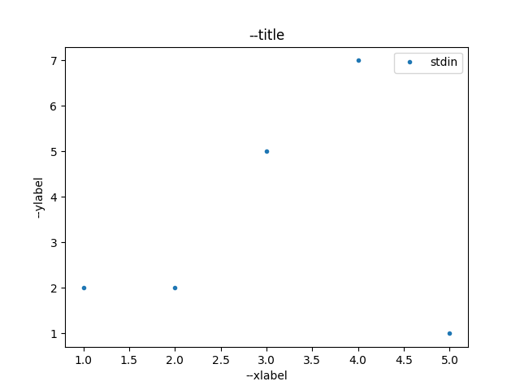
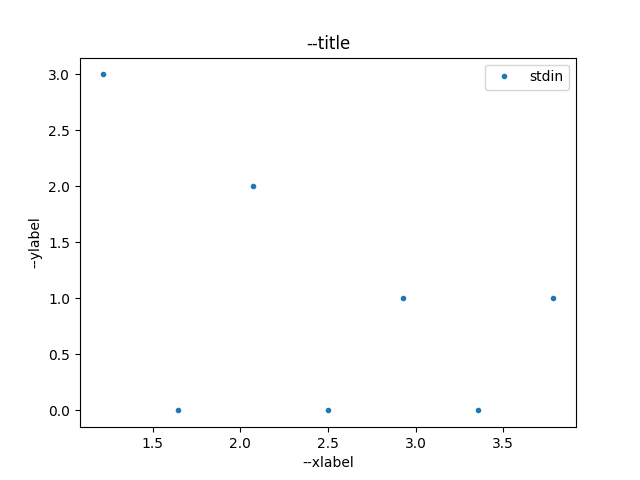
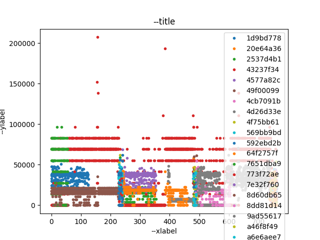

# plotty: A CLI Plotter

`plotty` is a CLI (command-line interface) script that allows plotting data. Its goals are to be flexible enough to replace small matplotlib-like scripts for most use cases. 


# Operation

plotty is a python script. It requires python3.


## Operation: Plot Mode

Basic operation consists of plotting a file containing a timeseries in CSV (comma-separated values) format.

```
$ echo -e "1,2\n2,2\n3,5\n4,7\n5,1\n" | ./plotty-plot.py -i - /tmp/plot.png
output is /tmp/plot.png
```



Figure 1 shows the output file of the plot command.

You can modify the values of the `xlabel`, `ylabel`, and `title` by using the corresponding options.

Use `--help` option to list all possible flasg:

```
$ ./plotty-plot.py --help
usage: plotty-plot.py [-h] [-d] [--quiet] [--marker MARKER]
                      [--title PLOTTITLE] [--xcol XCOL] [--xcol2 XCOL2]
                      [--ycol YCOL] [--ycol2 YCOL2] [--ydelta] [--ycumulative]
                      [--filter COL OP VAL] [--sep SEP] [--sep2 SEP2]
                      [--legend-loc LEGEND_LOC] [--histogram]
                      [--histogram-bins NBINS] [--histogram-sigma SIGMA]
                      [--histogram-ratio] [--xlabel XLABEL] [--ylabel YLABEL]
                      [--add-mean] [--add-median] [--add-stddev]
                      [--xlim left right] [--ylim bottom top]
                      [--yscale [linear | log | symlog | logit]]
                      [--xshift XSHIFT] [--yshift YSHIFT] [--fmt FMT]
                      [--label LABEL] [-i input-file]
                      [--batch-infile batch_infile] [--batch-sep SEP]
                      [--batch-col BATCHCOL] [--batch-label-col BATCHLABELCOL]
                      [--batch-filter COL OP VAL]
                      output-file

plot.py: simple data plotter. # http://stackoverflow.com/a/11249340 # runme #
$ echo -e "1,2 2,2 3,5 4,7 5,1 " | ./plotty-plot.py -i - /tmp/plot.png

positional arguments:
  output-file           output file

optional arguments:
  -h, --help            show this help message and exit
  -d, --debug           Increase verbosity (multiple times for more)
  --quiet               Zero verbosity
  --marker MARKER       use MARKER as plot marker
  --title PLOTTITLE     use PLOTTITLE plot title
  --xcol XCOL           use XCOL x col
  --xcol2 XCOL2         use XCOL2 for refining x col
  --ycol YCOL           use YCOL y col
  --ycol2 YCOL2         use YCOL2 for refining y col
  --ydelta              use $y[k] = (y[k] - y[k-1])$
  --ycumulative         use $y[k] = \sum_i=0^k y[i]$
  --filter COL OP VAL   select only rows where COL OP VAL is true
  --sep SEP             use SEP as separator
  --sep2 SEP2           use SEP2 as alternate separator
  --legend-loc LEGEND_LOC
                        Legend location
  --histogram           sort and bin xlist, get ylist as histogram
  --histogram-bins NBINS
                        use NBINS bins
  --histogram-sigma SIGMA
                        use avg += (SIGMA * stddev) to remove outliers
  --histogram-ratio     use ratio for ylist instead of total number
  --xlabel XLABEL       use XLABEL x label
  --ylabel YLABEL       use YLABEL x label
  --add-mean            Add a line at the mean
  --add-median          Add a line at the median
  --add-stddev          Add 2 lines at mean +- stddev
  --xlim left right
  --ylim bottom top
  --yscale [linear | log | symlog | logit]
                        yscale values
  --xshift XSHIFT       use XSHIFT x shift(s)
  --yshift YSHIFT       use YSHIFT y shift(s)
  --fmt FMT             use FMT format(s)
  --label LABEL         use LABEL label(s)
  -i input-file, --infile input-file
                        input file(s)
  --batch-infile batch_infile
                        conf input file
  --batch-sep SEP       use SEP as separator in the batch file
  --batch-col BATCHCOL  use BATCHCOL batch col
  --batch-label-col BATCHLABELCOL
                        use BATCHLABELCOL batch for label col
  --batch-filter COL OP VAL
                        select only batch rows where COL OP VAL is true
```

## Operation: Histogram Mode

Second operation mode consists of plotting a histogram for a variable in a timeseries in CSV (comma-separated values) format.

```
$ echo -e "1\n2\n1\n2\n3\n1\n4\n" | ./plotty-histogram.py -i - /tmp/histo.png
output is /tmp/histo.png
```



Figure 2 shows the output file of the histogram command.

You can modify the values of the `xlabel`, `ylabel`, and `title` by using the corresponding options.


## Operation: Batch Mode

While plotty allows repeating the `-i`, `--fmt`, and `--label` options to plot data from multiple files at the same time, we end up with shell lines that are too long. Instead, plotty provides a batch mode that allows defining the list of all files that need to be plotted at the same time in yet another CSV file.

```
$ cat in.csv
# id,ip_src,rtp_ssrc,rtp_p_type_list,ip_len,pkts,duration,filename
0,1.2.3.4,03c6af72,100,123905,398,595.3278110027313,in0.csv
1,1.2.3.4,4bab8bd5,100,121405,402,590.4864630699158,in1.csv
...
    
$ ~/proj/plotty/plotty-plot.py -d --xcol frame_time_relative \
    --ycol bitrate_last_interval \
    --batch-infile in.csv --batch-col filename --batch-label-col rtp_ssrc \
    --batch-filter id gt 44 out.png
```



Figure 3 shows the output file of the batch command.


# Requirements

Requires python3 with some packages.


## License

plotty is BSD licensed, as found in the [LICENSE](LICENSE) file.

